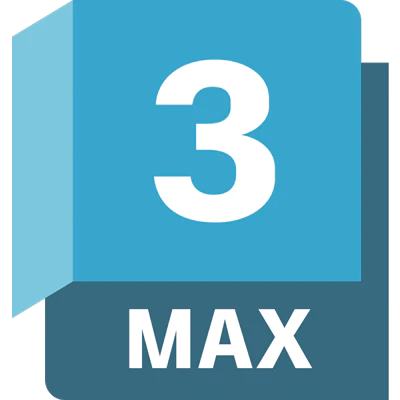

# Hi everyone, i'm Jin Yang

Hi, nice to meet you. Let me introduce my profile in a few lines.
  <ul>
    <li>👨‍🔧 I'm a <b>Student majoring</li>Game Development</b></li>
    <li>📍 Based in <b>Seoul, South Korea</b></li>
    <li>🏢 I'm a student in <b>Sogang University</b></li>
    <li>🌱 I'm currently learning <b>Game Development</b> and <b>Game Architecture</b></li>
    <li>💬 I love Video Games so <b>I'm learning to make one.</b></li>
    <li>📮 You can contact me directly here : <b>yohn1214@gmail.com</b>
  </ul>
Passionate learning to be an IT engineer, I am always looking for new challenges.
 For a few years now I've been focusing on 3D Game Development, especially with <b>Unreal5 Engine</b>. I'm also working on learning <b>3D Designs</b> with <b>3Ds Max.</b> 
If you want to discuss about it, feel free to contact me.

## 🌐 You can find me on :

  
  

## 🖥️ My Favorites :

  <h3><i>Games / Storyline:</i></h3>
  <table>
  <tr border: none;>
    <td align="center" width="110">
      
       Minecraft
    </td>	  
    <td align="center" width="110">
      
       Steam Games
    </td>
    <td align="center" width="110">
      
       Wizarding World
    </td>
    <td align="center" width="110">
      
       MCU
    </td>
  </tr>
</table>

  <h3><i>Languages:</i></h3>
  <table>
  <tr border: none;>
   <td align="center" width="110">
      
       TBU
    </td>
    <td align="center" width="110">
      
       TBU
    </td>
    <td align="center" width="110">
      
       TBU
    </td>
    <td align="center" width="110">
      
       TBU
    </td>
    <td align="center" width="110">
      
       TBU
    </td>
    <td align="center" width="110">
      
       TBU
    </td>
  </tr>
</table>

  <h3><i>Operating Systems:</i></h3>
  <table>
  <tr border: none;>
    <td align="center" width="110">
      
       Unity
    </td>	  
    <td align="center" width="110">
      
       TBU
    </td>
    <td align="center" width="110">
      
       TBU
    </td>
    <td align="center" width="110">
      
       TBU
    </td>
    <td align="center" width="110">
      
       TBU
    </td>
  </tr>
</table>

  <h3><i>Studying / Learning :</i></h3>
  <table>
  <tr border: none;>
    <td align="center" width="110">
      
       Access
    </td>	  
    <td align="center" width="110">
      
       MySQL
    </td>
    <td align="center" width="110">
      
       3Ds Max
    </td>
    <td align="center" width="110">
      
       Git Bash
    </td>
    <td align="center" width="110">
      
       TBU
    </td>
    <td align="center" width="110">
      
       TBU
    </td>
  </tr>
  <tr>
    <td align="center" width="110">
      
       TBU
    </td>	  
    <td align="center" width="110">
      
       TBU
    </td>
    <td align="center" width="110">
      
       TBU
    </td>
    <td align="center" width="110">
      
       TBU
    </td>
    <td align="center" width="110">
      
       TBU
    </td>
    <td align="center" width="110">
      
       TBU
    </td>
  </tr>
</table>

## 🚧 Projects and Dev Stuffs:

	
  
<b>⚡ Github Stats</b>

	
   
  
  

	
  
<b>☄️ Github Streaks</b>

   
  

  
<b>🧑‍🚀 Open Source Projects</b>

   
  <table>
    <thead align="center">
      <tr border: none;>
        <td><b>💻 Projects</b></td>
        <td><b>🌟 Stars</b></td>
        <td><b>🍴 Forks</b></td>
        <td><b>🐛 Issues</b></td>
        <td><b>🔔 Pull Requests</b></td>
        <td><b>👨‍💻 Language</b></td>
      </tr>
    </thead>
    <tbody>
      <tr>
	      <td><a href="https://github.com/iampavangandhi/Gitwar"><b>📦 openstack-alpine-images</b></a></td>
        <td></td>
        <td></td>
        <td></td>
        <td></td>
        <td></td>
      </tr>
      <tr>
	      <td><a href="https://github.com/linitio/docker-apps-collection"><b>🐳 docker-apps-collection</b></a></td>
        <td></td>
        <td></td>
        <td></td>
        <td></td>
        <td></td>
      </tr>
      <tr>
	      <td><a href="https://github.com/linitio/aws-resume"><b>👨🏻‍💻 aws-resume</b></a></td>
        <td></td>
        <td></td>
        <td></td>
        <td></td>
        <td></td> 
      </tr>
      <tr>
	      <td><a href="https://github.com/linitio/linitio"><b>🤓 linitio</b></a></td>
        <td></td>
        <td></td>
        <td></td>
        <td></td>
        <td></td> 
      </tr>
    </tbody>
  </table>
   

 

	
   
  
<b>⚙️ Things I use to get stuff done</b>

  	<ul>
  	    <li><b>OS:</b> macOS Monterey</li>
	    <li><b>Laptop: </b> MacBook Pro M1 13" & MacBook Pro M1 Pro 16"</li>
  	    <li><b>Browser: </b> Firefox Web Browser</li>
	    <li><b>Terminal: </b> ZSH: Oh My Zsh (PowerLevel10k)</li>
	    <li><b>Code Editor:</b> VSCode</li>
	    <li><b>To Stay Updated:</b> linit.io, Medium, Linkedin, Twitter and Youtube.</li>
	</ul>	

#

### Show some ❤️ by starring some of the repositories!

------
[linitio](https://github.com/linitio)
Last Edited on: 27/06/2022 
